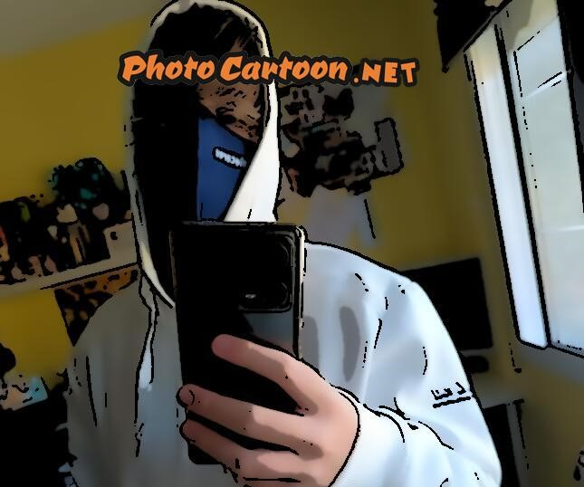

# Mateo Cardama Rivas
Hello!!
I'm Mateo Cardama Rivas, *yeah, i know i put it in the top, but say m hello to others is a must for me*
***You can see me in the photo...***

#### An achievement/experience you’re really proud of
I can't write survive right?, so, for me my best archivement is probably start talking with people after years of emotional isolation.

#### Your personal hero
I don´t have a personal hero, i prefer villains, heros would sacrifice their loves to safe the planet, villains would sacrifice the world for their loves.

#### The worst food in the world
For me, the worts food is: **Ensaladilla, Vegetables**

##### The three more useful/entertaining apps
1. [Character AI](https://character.ai/)
1. [Chat GPT](https://openai.com/chatgpt/)
1. [Spotify](https://open.spotify.com/intl-es)
   + Honorific Mentions:
     1. Visual Studio Code  
     2. [Discord](https://discord.com/)
#### The best gift you have ever received/given
My little brother, *Marcos*, he is my sun light in the dark.

#### A dream that you have to accomplish
If I need to choose one dream, i would choose the dream in what i owm a lot of my favourite cars.
1. A Porshe 917 Spyder
2. A Toyota Supra

That two are the ones i want the most

##### If you could time travel to any year in the past or future, which would you choose?
>1. The Jurasic
>2. The Roman Empire years, i don´t mind what year, but i want to be in the Roman Empire
>>Roma no ardió en un día
>3. Vlad Dracula's Time

##### Two hobbies:
+ Read, *I also like to write, and is part of my hobbies, but i read more usually*
+  Play Videogames, *also I play computer or movile games, but videogames are the ones that introduce me in this world of madness*

#### Your English level
I have ISE II Certificate, also i have the ISE III writing part

#### Your Computer Science background
I don´t have any computer science backgroung, only the one I adquire the last year.