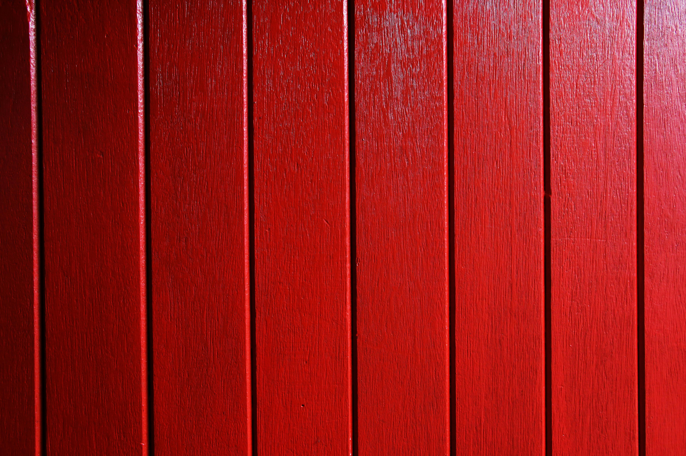

# heading level 1
This is not a heading
## heading level 2
### heading level 3
#### heading level 4
This is not a heading but sees like one
##### heading level 5
###### heading level 6
I exist

muuuuu

This is an **important** word, this is *less* important, ***motherfucker***.

List of colours:

* White

* Black

* Red

* Green

List of students:

1. Mateo
1. Fernando
1. Anabel
1. Laura

List of **animals**:

* Mammals
    * Dolphin
    * Cangaroo
    * Red panda
    * Platycus
* Insect
    * Ant
    * Spider
    * Beetle
* Fish
    * Salmon
    * Tuna


Several Links:

[conselleria de educación](https://www.edu.xunta.gal/)

<https://mestre.iessanclemente.net>



`HTML` -HyperText Markup Language

```xml
<amimal>
    <name>Horse</name>
</animal>
```
More info

***

This is an 
\* in the code

<> Angle braquets
[] Square braquets
()
{}

> To be or not to be 
>> To ve or not to be, the resurrection
>>> To be or not to be, te revenge
>>>> Detergente

---

